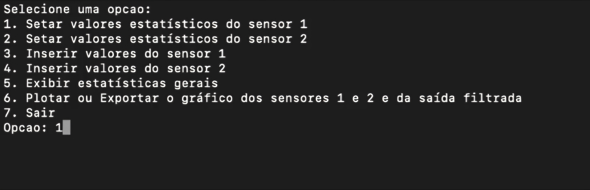

# Filtro Kalman

**Disciplina**: FGA0210 - PARADIGMAS DE PROGRAMAÇÃO - T01 <br>
**Nro do Grupo (de acordo com a Planilha de Divisão dos Grupos)**: 01<br>
**Paradigma**: Funcional<br>

## Alunos
|Matrícula | Aluno |
| -- | -- |
| 19/0023376 |   Abraão Alves Ribeiro |
| 19/0094257 |   Paulo Henrique Rezende |
| 19/0047968 |   Paulo Vitor Silva Abi| Acl 
| 23/2022952 |   Leonardo de Souza Takehana| 
| 19/0026600 |   Davi Marinho da Silva Campos | 
| 19/0105267 |   Diógenes Dantas Lélis Júnior| 
| 19/0103302 |   Bernardo Chaves Pissutti |
| 17/0161871 |   Denniel William Roriz Lima| 
| 18/0113321 |   Francisco Mizael Santos da Silva | 
| 19/0093196 |   Mateus Caltabiano Neves Frauzino| 
| 19/0091720 |   Lucas Macedo Barboza |

## Sobre 
O projeto proposto visa implementar um filtro de Kalman em Haskell, uma linguagem de programação funcional, e suas funcionalidades associadas. O filtro de Kalman é um algoritmo de estimativa usado para estimar o estado de um sistema dinâmico a partir de medidas imprecisas e incompletas. Ele é amplamente utilizado em diversas áreas, como engenharia de controle, robótica, navegação, processamento de sinais e finanças.

A implementação do filtro de Kalman em Haskell será baseada em um código MATLAB fornecido como exemplo. O projeto se divide em diversas funcionalidades, atribuídas a grupos específicos de trabalho:

Importação e Parseamento de Dados (Dupla A): Esta funcionalidade envolve a importação de dados de entrada em formato CSV e seu parseamento para que Haskell possa interpretá-los.

Cálculo de Média Real, Desvio Padrão Real e Estimativa de Erros (Quarteto B): Este grupo será responsável pelo cálculo da média real, do desvio padrão real e pela estimativa de valores de erros.

Cálculo da Predição e Correção (Dupla C): Nesta etapa, serão implementadas as funções responsáveis pelo cálculo da predição e correção, fundamentais no filtro de Kalman.

Exportação de Dados de Saída (Dupla A): Após o processamento, os resultados serão exportados em formato CSV.

Plotagem de Dados em Gráficos (Trio D): Este grupo será responsável por plotar os dados resultantes em gráficos, destacando valores de erro, médias e desvios.

O projeto será organizado utilizando branches separadas para cada funcionalidade, facilitando a manutenção e o desenvolvimento paralelo. O alinhamento entre os grupos será essencial para garantir a integração adequada das diferentes partes do projeto.

Para implementar este projeto, será necessário um conhecimento sólido em Haskell, bem como compreensão dos conceitos de filtro de Kalman e suas aplicações. Além disso, o uso de bibliotecas para manipulação de CSV e plotagem de gráficos em Haskell pode ser necessário.

Referências úteis para o desenvolvimento deste projeto incluem:

[Documentação do Haskell](https://www.haskell.org/documentation/)

[Artigo sobre Filtro de Kalman em Haskell]()

## Screenshots
<!-- Adicione 2 ou mais screenshots do projeto em termos de interface e/ou funcionamento. -->
1. Menu principal 



2. Dados de valores


## Instalação 
**Linguagens**: Haskell<br>
**Tecnologias**: Stack<br>
<!-- Descreva os pré-requisitos para rodar o seu projeto e os comandos necessários.
Insira um manual ou um script para auxiliar ainda mais.
Gifs animados e outras ilustrações são bem-vindos! -->
1. Instalar o GHC em https://www.haskell.org/ghc/
2. Instalar o stack em seu ambiente
###  Linux
```
curl -sSL https://get.haskellstack.org/ | sh
```
ou 
```
wget -qO- https://get.haskellstack.org/ | sh
```
### MacOS
```
curl -sSL https://get.haskellstack.org/ | sh
```
ou 
```
wget -qO- https://get.haskellstack.org/ | sh
```
### Windows
- Acesse o site (https://docs.haskellstack.org/en/stable/) para mais informações
3. Faça um clone do projeto
```
git clone https://github.com/UnBParadigmas2024-1/2024.1_G1_Funcional_Filtro_Kalman.git
```
4. Entre na pasta
```
cd 2024.1_G1_Funcional_Filtro_Kalman
```
5. Rode a build
```
stack build
```
6. Inicie o projeto
```
stack run
```

## Uso 
Explique como usar seu projeto.
Procure ilustrar em passos, com apoio de telas do software, seja com base na interface gráfica, seja com base no terminal.
Nessa seção, deve-se revelar de forma clara sobre o funcionamento do software.

## Vídeo

## Participações
Apresente, brevemente, como cada membro do grupo contribuiu para o projeto.
|Nome do Membro | Contribuição | Significância da Contribuição para o Projeto (Excelente/Boa/Regular/Ruim/Nula) |
| -- | -- | -- |
| Paulo Henrique  | Idealização inicial do projeto com o takehana definindo os grupos e criando o documento inicial,Criação do data Parameters que foi inicial utilizado pra definir os parâmetros de entrada,Criação das funções de filtro de kalman na predição e correção, multiplicação de matriz, inversão da matriz e geração das medidas, Refatorei o código para torná-lo mais modularizado possível (Separando em datas, utils, menu, main)Auxiliei todos os grupos no momento de integrar os módulos com correção de código e explicando a estrutura do projeto | Excelente |
| Paulo Vitor Silva Abi Acl  |  Colaborei na implementação da plotagem dos gráficos, principalmente na parte inicial | Excelente |
| Leonardo de Souza Takehana  |  Modelagem matemática do problema, elaboração do filtro de Kalman com correção e predição, funções para manipulação de matrizes, organização da equipe e integração do código | Excelente |
| Davi Marinho da Silva Campos  |  Implementação das funções de média, desvio padrão e variância  | Excelente |
| Diógenes Dantas Lélis Júnior  |  Importar os dados de um arquivo CSV e armazená-los em listas. Uma lista principal será uma lista de listas, onde cada sub-lista terá 1000 valores. Além disso, haverá duas listas adicionais, cada uma representando uma coluna diferente do CSV: uma para a coluna tempo e outra para a coluna medição. | Excelente |
| Bernardo Chaves Pissutti  |  Implementação das funções de média, desvio padrão e variância | Excelente |
| Abraão Alves  |  ajuda na construção e definição daplotagem de graficos  e contrução do menu principal da aplicação | Boa |
| Denniel William Roriz Lima  |  Exportar CSV e suas subfunções que é transformar a lista para o formato do item, ou seja, um array de items. E por fim a função de conversão | Excelente |
| Francisco Mizael Santos da Silva  |  Implementação da plotagem dos graficos  | Excelente |
| Mateus Caltabiano Neves Frauzino  |  - | - |
| Lucas Macedo Barboza  | Ajuda na estruturação das funções de Medias, desvios padrões e variâncias| Boa |

## Outros 
Quaisquer outras informações sobre o projeto podem ser descritas aqui. Não esqueça, entretanto, de informar sobre:
### Organização de tarefas 
O grupo foi separado em quatro grupos menores para as atividades ficarem melhor organizadas. A divisão de tarefas entre cada subgrupo foi a  seguinte:
* **Dupla A**: Importar os dados de entrada (csv) e Parsear os dados de entrada para
que o haskel consiga interpretar e Exportar os dados de saída (csv);
* **Quarteto B**: Calcular média real (Calcula media normal), Cálcula desvio padrão real (Calcula desvio padrão real normal) e Estimar valores de erros;
* **Dupla C** : Calcular a Predição e Calcular a correção. 
* **Trio D**: Plotar no dados no gráficos de forma sobreposta (Valores de erro, Médias,
Desvio)

### Percepções 
    * Dificuldade em se adaptar a linguagem e ao paradigma funcional;
    * Dificuldade na instalação das bibliotecas de gráficos


## Fontes
<!-- Referencie, adequadamente, as referências utilizadas.
Indique ainda sobre fontes de leitura complementares. -->
1. HASKELL. Documentação do Haskell. Disponível em: https://www.haskell.org/documentation/. Acesso em: 15 de abril de 2024.
2. HASKELL STACK. Documentação do Haskell Stack. Disponível em: https://docs.haskellstack.org/en/stable/. Acesso em: 15 de abril de 2024.
3. APRENDER 3. Materiais disponibilizados em: https://aprender3.unb.br/course/view.php?id=22091&section=2. Acesso em: 15 de abril de 2024.
4. CASSAVA. Documentação do Cassava. Disponível em: https://hackage.haskell.org/package/cassava. Acesso em: 15 de abril de 2024.
